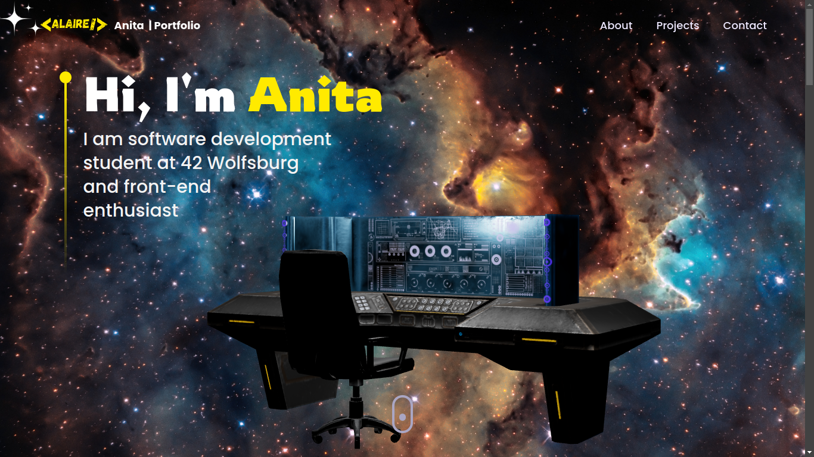

# Portfolio website

### 3D models credits:
Who made it: **Lee Alex Johansson**
What is it: "Weathered Workstation" 3D model
Copyright: © 2018 Lee Alex Johansson
License: CC BY 4.0 International License (https://creativecommons.org/licenses/by/4.0/#ref-appropriate-credit)
Link: [https://sketchfab.com/3d-models/weathered-workstation-dc877404be0445f0a855e37f2747794a]

Who made it: **EmreKazaz**
What is it: "hologram gezegen" 3D model
Copyright: © 2023 EmreKazaz
License: CC BY 4.0 International License ([https://creativecommons.org/licenses/by/4.0/#ref-appropriate-credit])
Link: [https://sketchfab.com/3d-models/hologram-gezegen-04eb5d4c661f4179ac3f49f2dccb988c]
